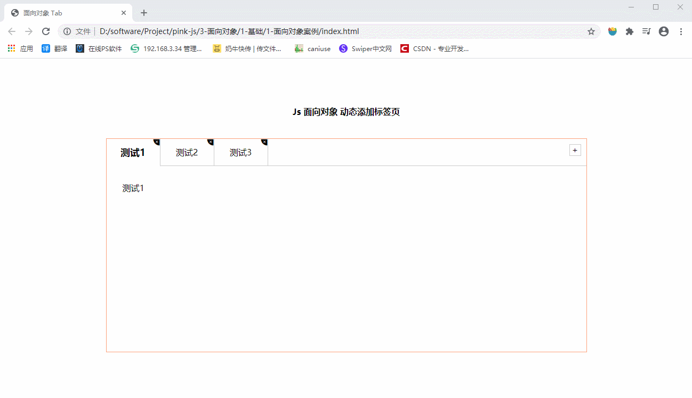
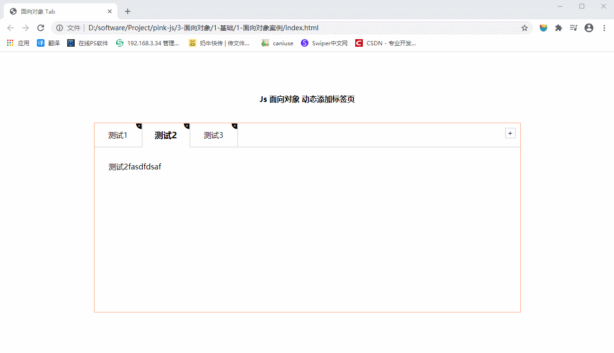

:::tip
  **面向过程POP**就是分析出解决问题所需要的步骤，然后用函数把这些步骤一步一步实现，使用的时候再一个一个的依次调用就可以了。
  **面向对象OOP**是把事务分解成为一个个对象，然后由对象之间分工与合作。
:::

<!-- more -->

## 一、面向对象导读
- **面向过程POP**就是分析出解决问题所需要的步骤，然后用函数把这些步骤一步一步实现，使用的时候再一个一个的依次调用就可以了。
- **面向对象OOP**是把事务分解成为一个个对象，然后由对象之间分工与合作。

两者比较

**面向过程**
- 优点：**性能**比面向对象**高**，适合跟硬件联系很紧密的东西,
- 缺点：**不易维护、不易复用、不易扩展**。

**面向对象**
- 优点：**易维护、易复用、易扩展**，由于面向对象有封装、继承、多态性的特性，可以设计出**低耦合**的系统，使系统 更加灵活、更加易于维护，
- 缺点：**性能**比面向过程**低**。


>面向对象是把事务分解成为一个个对象，然后由对象之间分工与合作

**举个栗子**：将大象装进冰箱，面向对象做法

先找出对象，并写出这些对象的功能
1. 大象对象
进去
2. 冰箱对象
打开
关闭
3. 使用大象和冰箱的功能

面向对象是**以对象**功能来**划分问题**，而不是步骤。


## 二、ES6中的类和对象
 >在 JavaScript中，对象是一组无序的相关属性和方法的集合，所有的事物都是对象，例如字符串、数值、数组、函数等。

现实生活中：万物皆对象，对象是一个具体的事物，看得见摸得着的实物。例如，一本书、一辆汽车、一个人可以是“对象”，—个数据库、一张网页、一个与远程服务器的连接也可以是“对象”.

对象是由**属性**和**方法**组成的
- 属性：事物的**特征**，在对象中用**属性**来表示（常用名词）
- 方法：事物的**行为**，在对象中用**方法**来表示（常用动词）

### 2.1 class 类
在ES6中新增加了类的概念，可以使用 class关键字声明一个类，之后以这个类来实例化对象。

**类**抽象了对象的公共部分，它**泛指某大类**（class）
**对象**特指某一个，通过类实例化**一个具体**的对象

面向对象的思维特点：
1. 抽取（抽象）对象共用的属性和行为组织（封装）成一个**类**（模板
2. 对类进行实例化获取类的**对象**

### 2.2 创建类
语法：
```javascript
class name{
  // class body
}
```

创建实例：

```javascript
var foo = new name()
```
### 2.3 constructor 构造函数

**constructor**()方法是类的构造函数（默认方法），**用于传递参数返回实例对象**
过**new命令**生成对象实例时，自动调用该方法。如果没有显示定义,类内部会自动给我们创建一个 **constructor**()


### 2.4 创建第一个类和对象

```javascript
// 1.创建类 class 创建一个明显类
class Star {
  constructor(uname, age) {
    this.uname = uname //this 指向创建的实例  this=>ldh
    this.age = age
  }
}

// 2.利用类创建对象
let ldh = new Star('刘德华', 18)
let zxy = new Star('张学友', 20)

console.log(ldh); //  {uname: "刘德华", age: 18}
console.log(zxy); //  {uname: "张学友", age: 20}
```
注意事项：
 1. 通过class 关键字创建类, 类名我们还是习惯性定义**首字母大写**
 2. 类里面有个constructor 函数,可以**接受**传递过来的**参数**,同时**返回实例对象**
 3. constructor 函数 只要 new 生成实例时,就会**自动调用**这个函数,如果我们不写这个函数,类也会**自动生成**这个**函数**
 4. 生成实例 new 不能省略
 5. 最后注意语法规范, 创建类 **类名**后面**不**要**加小括号**,生成实例 类名后面加小括号, 构造函数不需要加function


### 2.5 类中添加方法
注意事项：
1. 类里边**所有函数** **不需要写 function 关键字**
2. 多个函数或者方法之间**不需要加**  **,(逗号)**
```javascript
// 1.创建类 class 创建一个明显类
class Star {
  constructor(uname, age) {
    this.uname = uname //this 指向创建的实例  this=>ldh
    this.age = age
  }
  sing(song) {
    console.log(this.uname + '唱' + song)
  }
}
// 2.利用类创建对象
let ldh = new Star('刘德华', 18)
let zxy = new Star('张学友', 20)

console.log(ldh); //  {uname: "刘德华", age: 18}
console.log(zxy); //  {uname: "张学友", age: 20}

ldh.sing('冰雨') //刘德华唱冰雨
zxy.sing('李香兰') //张学友唱李香兰
```
### 2.6 注意事项
1. 在Es6中类**没有变量提升**，所以必须先**定义类**，**才能**通过类**实例化**对象
2. 类里面共有的属性和方法**一定要加this使用**
3. 类里边的this指向问题

	- **constructor里面的this指向实例对象**
	- **方法里面的this指向这个方法的调用者**

**this指向问题案例**：
```javascript
var that;
var _that;
class Star {
    constructor(uname, age) {
        // constructor 里面的this 指向的是 创建的实例对象
        that = this;
        console.log(this);

        this.uname = uname;
        this.age = age;
        // this.sing();
        this.btn = document.querySelector('button');
        this.btn.onclick = this.sing;
    }
    sing() {
        // 这个sing方法里面的this 指向的是 btn 这个按钮,因为这个按钮调用了这个函数
        console.log(this);

        console.log(that.uname); // that.uname刘德华 that里面存储的是constructor里面的this  
    }
    dance() {
        // 这个dance里面的this 指向的是实例对象 ldh 因为ldh 调用了这个函数
        _that = this;
        console.log(this); //Star {uname: "刘德华", age: undefined, btn: button}

    }
}

var ldh = new Star('刘德华');
console.log(that === ldh); //true
ldh.dance();
console.log(_that === ldh); // true
```

## 三、继承
现实中的继承：子承父业，比如我们都继承了父亲的姓

程序中的继承：**子类**可以**继承父类**的一些**属性和方法**。

>继承中，如果实例化子类输出一个方法，先看子类有没有这个方法，如果有就先执行子类的方法，如果子类里面没有，就去查找父类有没有这个方法，如果有，就执行父类的这个方法（就近原
则）


### 3.1 语法

```javascript
class Father{
	//父类
}
class son extends father{
	//子类继承父类
}
```

示例：

```javascript
// 1.类的继承
class Father{
  constructor(){
  }
  money(){
    console.log(100);
  }
}

class Son extends Father{
}

let son = new Son()
son.money()  //100
```

### 3.2 super(超级的) 关键字
**super**关键字用于访问和调用对象父类上的函数。可以**调用**父类的**构造函数**，**也可以调用**父类的**普通函数**


示例：调用**构造函数**

```javascript
class Father{
  constructor(x,y){
    this.x = x
    this.y = y
  }
  sum(){
    console.log(this.x + this.y)
  }
}
class Son extends Father{
  constructor(x,y){
    // 这里不能访问父类的 this,父类的sum函数中的this是父类的，子类值没有传递进去
    // this.x = x // 报错
    // this.y = y // 报错

    super(x,y);//调用父类中的构造函数
  }
}

let son = new Son(1,2)
son.sum() // 3
```

示例：调用**普通函数**

```javascript
// super调用父类的普通函数
class Father {
  say() {
    return '我是爸爸'
  }
}
class Son extends Father {
  say() {
   //调用父类的普通方法
    console.log(super.say()); //我是爸爸
  }
}
let son = new Son()
```
# ### 3.3 继承方法的同时扩展方法
需求：继承父类的加法方法的同时，自己扩展一个减法方法。

注意事项：**调用父类的函数时**，super必须在子类this之前调用(**父亲必须放在之前**)
```javascript
// 父类加法操作
class Father {
  constructor(x, y) {
    this.x = x
    this.y = y
  }
  sum() {
    console.log(this.x + this.y);
  }
}
// 子类继承父类加法方法的同时扩展减法操作
class Son extends Father {
  constructor(x, y) {
    // 调用父类的构造函数 super必须在子类this之前调用(父亲必须放在之前)
    super(x, y)

    this.x = x
    this.y = y
  }
  subtract() {
    console.log(this.x - this.y);
  }
}

let son = new Son(5, 3)
son.subtract() // 2
son.sum() // 8
```


## 四、Tab栏 案例
功能描述：

 1. 点击Tab栏能实现**切换**
 2. Tab栏和内容 点击右上角×号能**删除**当前**栏目和内容** 
 3. 点击加号能实现**增加Tab栏**功能
 4. **双击Tab栏**，可以**编辑Tab栏名称** 
 5. **双击内容**，可**编辑内容**

### 获取：
1. [点此访问该Demo](http://120.53.120.229:8080/Project/)
2. 你可以去蓝奏云下载: [面向对象案例.zip](https://wws.lanzous.com/i2Lw6i35pta) 的Demo文件
3. 或观看**文档底部**的 **实例代码！**


是不是太棒了，在21世纪是不是 很久没有遇到博主这样贴心的人才了吧！
那还愣着干什么，<font color='red'> **点赞关注** </font>走一波啊！


### 4.1 点击Tab栏能实现切换 Tab栏和内容


### 4.2 点击右上角×号能删除当前栏目和内容


### 4.3 点击加号能实现增加Tab栏效果


### 4.4 双击Tab栏，可以编辑Tab栏名称


### 4.5 双击内容，可编辑内容


### 4.6 细节方面：

 1. **删除**一个栏目**后默认选中前一个**栏目
 2. 新增的栏目**也能实现基本功能**
 3. 当默认选中的是第一个，并且删除的时候，选中删除后的第一个
 4. 在编辑Tab名称的时候，**回车键**也能**确认**编辑
 5. 新增的栏目**默认选中**


再说一遍： [点此访问该Demo](http://120.53.120.229:8080/Project/)
你可以去蓝奏云下载: [面向对象案例.zip](https://wws.lanzous.com/i2Lw6i35pta) 的Demo文件
或观看**文档底部**的 **实例代码！**

注意：该demo小图标用到了 **[阿里巴巴的 iconfont](https://www.iconfont.cn/)** ，复制我贴出的代码会**没有小图标**哦！


<h1> JS部分：tab.js </h1>

```javascript
let that = null
class Tab {
  constructor(id) {
    // 1.获取元素
    this.main = document.querySelector(id)
    this.tabadd = this.main.querySelector('.tabadd')

    // li的父元素 
    this.ul = this.main.querySelector('.fisrstnav ul:first-child')
    // section福元素
    this.fatherSection = this.main.querySelector('.tabscon')

    that = this
    this.init()
  }
  // 初始化
  init() {
    this.updateNode();

    // inti 初始化操作 让相关的元素绑定事件
    for (let i = 0; i < this.lis.length; i++) {
      this.lis[i].setAttribute('data-index', i)
      this.lis[i].onclick = this.toggleTab;
      this.remove[i].onclick = this.removeTab;
      this.spans[i].ondblclick = this.editTab;
      this.sections[i].ondblclick = this.editTab;
    }

    this.tabadd.onclick = this.add
  }
  // 更新数据列表
  updateNode() {
    this.lis = this.main.querySelectorAll('li')
    this.sections = that.main.querySelectorAll('section')
    this.remove = this.main.querySelectorAll('.icon-guanbi')
    this.spans = this.main.querySelectorAll('.fisrstnav li span:nth-child(1)')
    console.log('this.spans: ', this.spans);
  }
  // 1.切换功能
  toggleTab() {
    that.clearClass()

    this.className = 'liactive'
    that.sections[this.getAttribute('data-index')].className = 'conactive'

  }
  clearClass() {
    for (let i = 0; i < this.lis.length; i++) {
      this.lis[i].className = ''
      this.sections[i].className = ''
    }
  }
  // 2.添加
  add() {
    // 清除所有选中
    that.clearClass()

    // 1.创建 li元素和section元素
    let random = Math.round(Math.random() * 100, 3)
    let li = '<li class="liactive"><span>Tab</span><span class="iconfont icon-guanbi"></span></li>'
    let section = '<section class="conactive">新内容' + random + '</section>'

    // 2.追加元素 使用 insertAdjacentHTML 支持字符串形式
    that.ul.insertAdjacentHTML('beforeend', li)
    that.fatherSection.insertAdjacentHTML('beforeend', section)

    // 更新
    that.init()
  }

  // 3.删除
  removeTab(e) {
    // 阻止时间冒泡 防止触发li的点击切换事件
    e.stopPropagation();

    let index = this.parentNode.getAttribute('data-index')

    // 根据索引号 删除对应li和section  remove方法可以直接删除指定的元素
    that.lis[index].remove()
    that.sections[index].remove()

    that.init()

    // 当我们删除的不是选中状态的li的时候，原来的选定状态保持不变即可

    // 该句核心思想，如果删除的是当前选中项，删除过后页面上没有 .liactive 进入判断，直接return 否则跳过
    if (document.querySelector('.liactive')) return;

    // 当我们删除过后，设置默认选中其一个
    index == 0 ? index = 0 : index--
    that.lis[index] && that.lis[index].click()
  }

  // 4.编辑
  editTab(e) {
    // 双击禁止选中文字
    window.getSelection ? window.getSelection().removeAllRanges() : document.selection.empty();

    let str = this.innerHTML;
    console.log(this);
    this.innerHTML = '<input type="text" value= />'
    let input = this.children[0]
    input.value = str
    input.select() //文本框内的文字处于选定状态

    // 按下回车
    input.addEventListener('keyup', function (e) {
      if (e.keyCode === 13) {
        // 手动调用表单失去焦点事件
        this.blur();
      }
    })
    input.onblur = function () {
      debugger
      this.parentNode.innerHTML = this.value
    }
  }
}
#let tab = new Tab('#tab');
```

<h1> HTML部分：index.html </h1>

```html
<!DOCTYPE html>
<html lang="en">

<head>
    <meta charset="UTF-8">
    <meta name="viewport" content="width=device-width, initial-scale=1.0">
    <meta http-equiv="X-UA-Compatible" content="ie=edge">
    <title>面向对象 Tab</title>
    <link rel="stylesheet" href="./styles/tab.css">
    <link rel="stylesheet" href="./styles/style.css">
</head>

<body>

    <main>
        <h4>
            Js 面向对象 动态添加标签页
        </h4>
        <div class="tabsbox" id="tab">
            <!-- tab 标签 -->
            <nav class="fisrstnav">
                <ul>
                    <li class="liactive"><span>测试1</span><span class="iconfont icon-guanbi"></span></li>
                    <li><span>测试2</span><span class="iconfont icon-guanbi"></span></li>
                    <li><span>测试3</span><span class="iconfont icon-guanbi"></span></li>
                </ul>
                <div class="tabadd">
                    <span>+</span>
                </div>
            </nav>

            <!-- tab 内容 -->
            <div class="tabscon">
                <section class="conactive">测试1</section>
                <section>测试2</section>
                <section>测试3</section>
            </div>
        </div>
    </main>

    <script src="js/tab.js"></script>
</body>

</html>
```

<h1> CSS部分：tab.css</h1>

```css
* {
    margin: 0;
    padding: 0;
}

ul li {
    list-style: none;
}

main {
    width: 960px;
    height: 500px;
    border-radius: 10px;
    margin: 50px auto;
}

main h4 {
    height: 100px;
    line-height: 100px;
    text-align: center;
}

.tabsbox {
    width: 900px;
    margin: 0 auto;
    height: 400px;
    border: 1px solid lightsalmon;
    position: relative;
}

nav ul {
    overflow: hidden;
}
nav ul li {
    float: left;
    width: 100px;
    height: 50px;
    line-height: 50px;
    text-align: center;
    #border-right: 1px solid #ccc;
    position: relative;
    cursor: pointer;
    user-select: none;
}

nav ul li.liactive {
    #border-bottom: 2px solid #fff;
    z-index: 9;
}
nav ul li.liactive span:first-child{
    font-size: 18px;
    font-weight: bold;
}
##tab input {
    width: 80%;
    height: 60%;
}

nav ul li span:last-child {
    position: absolute;
    user-select: none;
    font-size: 12px;
    top: -18px;
    right: 0;
    display: inline-block;
    height: 20px;
}

.tabadd {
    position: absolute;
    /* width: 100px; */
    top: 0;
    right: 0;
    cursor: pointer;
}

.tabadd span {
    display: block;
    width: 20px;
    height: 20px;
    line-height: 20px;
    text-align: center;
    #border: 1px solid #ccc;
    float: right;
    margin: 10px;
    user-select: none;
}

.tabscon {
    width: 100%;
    height: 300px;
    position: absolute;
    padding: 30px;
    top: 50px;
    left: 0px;
    box-sizing: border-box;
    #border-top: 1px solid #ccc;
}

.tabscon section,
.tabscon section.conactive {
    display: none;
    width: 100%;
    height: 100%;
}

.tabscon section.conactive {
    display: block;
}
```
