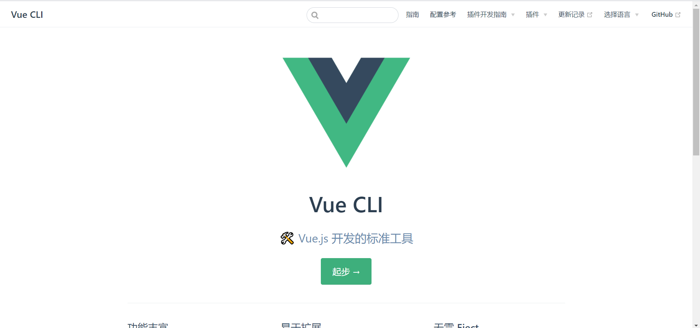
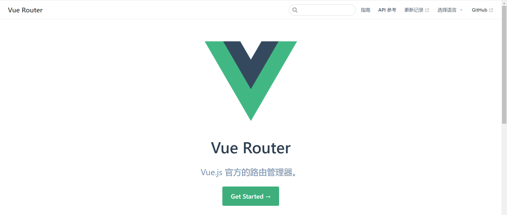
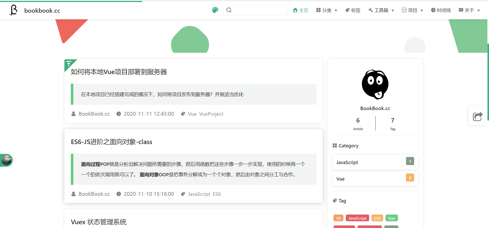
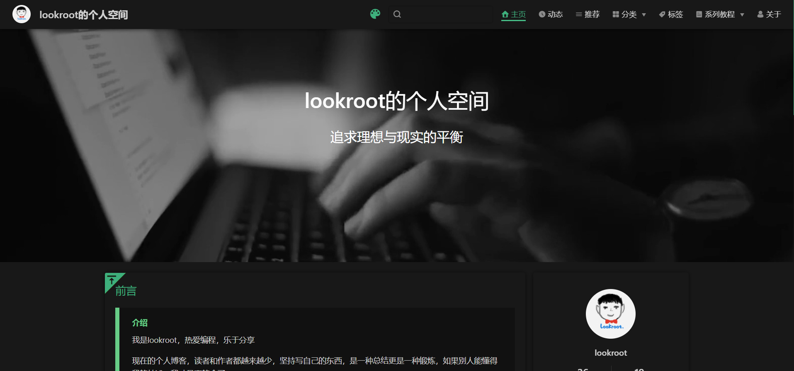

:::tip
如何搭建一个和博主一样的博客网站？请看这里
:::

<!-- more -->

## 一、介绍
首先，我需要告诉你的是，其实搭建一个这样的博客网站，本身并不复杂，甚至可以说简单(当然，在你不自主开发主题的情况下)，你只需要了解 Js+Vue+VuePress即可。
博主从看见别人的博客，到自己开始搭建，**总耗时三天**，并且还是拖拖拉拉的状态下完成的，如果你认真的话，我相信你甚至不需要**一天**就能搞好，是不是 so easy。那么 就让我们开始吧。

## 二、VuePress
本博客是基于尤大大(尤雨溪)开发的 一款免费开源的 极简网站生成器 [VuePress](https://vuepress.vuejs.org/zh/guide/) + [vuepress-theme-reco](https://vuepress-reco-doc.now.sh/) 主题 构建而成，如果你还不知道 VuePress 是什么东西，那么我推荐你去 Bilibili看一下这两个视频，我相信，你去看完这两个视频过后，就不会在这儿继续听我 瞎bb了。

1. bilibili [一步步搭建 VuePress 及优化](https://www.bilibili.com/video/BV1vb411m7NY?from=search&seid=12895446522739007147)
2. bilibili [1小时带你搭建vuepress高大上个人博客（极速上手版）](https://www.bilibili.com/video/BV17t41177cr?from=search&seid=12895446522739007147)

建议你两个视频都看，先看第一个。
如果你在学习过程中**遇到任何问题**都可以**直接找我**，你可以在本文下方留言，可以通过QQ：2845486124 联系我，也可以通过微信 P200048联系我，总之一切能联系到我的地方都行。
本人逛CSDN 比较多哦~(你可以CSDN私信)

## 三、VuePress-theme-reco

当你看完以上两个视频过后，你会发现你搭建的博客是类似 **Vue** 官网风格的，例如：

但是你看见的大多数个人博客并不是那些风格，例如：

此时 你需要了解 [VuePress-theme-reco](https://vuepress-reco-doc.now.sh/),这是一位大佬开源的一款 VuePress 主题。使用它你就能使用极少的配置搭建一款不错的个人博客。

好了，本文就到这里，如果你有什么奇怪的想法或者疑惑可以联系我，也许我能帮助到你。

|QQ|WeChat|
|--|--|
|||